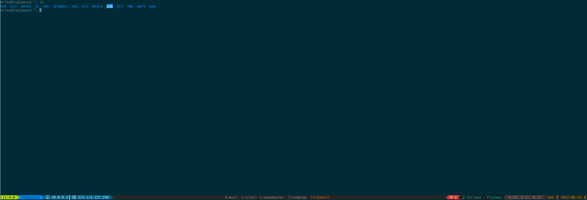
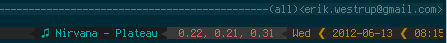
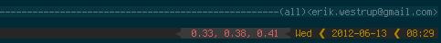
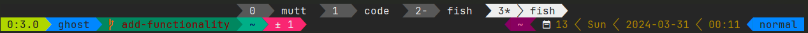

<!-- markdownlint-disable first-line-heading -->
<p align="center">

</p>
<p align="center"><i>Empowering your tmux (status bar) experience!</i></p>
<hr>

<p align="center">


</p>

<!-- markdownlint-disable no-empty-links -->
[](https://github.com/erikw/tmux-powerline/actions/workflows/linter-full.yml)
[](#)
[](#)
[](#)
[](https://github.com/erikw/tmux-powerline/issues)
[](https://github.com/erikw/tmux-powerline/issues?q=is%3Aissue+is%3Aclosed)
[](https://github.com/erikw/tmux-powerline/pulls?q=is%3Apr+is%3Aclosed)
[](LICENSE.txt)
[](https://github.com/Netflix/osstracker)
[](https://github.com/erikw/tmux-powerline/tags)
<br>
<!-- markdownlint-enable no-empty-links -->

[](https://github.com/erikw/tmux-powerline/graphs/contributors) including these top contributors:
<a href="https://github.com/erikw/tmux-powerline/graphs/contributors">

</a>


# Intro
tmux-powerline is a tmux <a title="Tmux Plugin Manager" href="https://github.com/tmux-plugins/tpm">tpm</a> plugin that gives you a slick and hackable powerline status bar consisting of segments. It's easily extensible with custom segments and themes.
The plugin itself is implemented purely in bash thus minimizing system requirements. However you can make segments in any language you want (with a shell wrapper).

Some examples of segments available that you can add to your tmux status bar are (full list [here](https://github.com/erikw/tmux-powerline/tree/main/segments)):
* LAN & WAN IP addresses
* Now Playing for MPD, Spotify (GNU/Linux native or wine, macOS), iTunes (macOS), Rhythmbox, Banshee, MOC, Audacious, Rdio (macOS), cmus, Pithos and Last.fm (last scrobbled track).
* New mail count for GMail, Maildir, mbox, mailcheck, and Apple Mail
* GNU/Linux and macOS battery status (uses [richo/dotfiles/bin/battery](https://github.com/richoH/dotfiles/blob/master/bin/battery))
* Weather in Celsius, Fahrenheit and Kelvin using Yahoo Weather
* System load, cpu usage and uptime
* Git, SVN and Mercurial branch in CWD
* Date and time
* Hostname
* tmux info
* tmux mode indicator (normal/prefix, mouse, copy modes)
* CWD in pane
* Current X keyboard layout
* Network download/upload speed
* Earthquake warnings

# Screenshots
**Full screenshot**

<a href="img/full.png" title="Full screenshot"></a>

**left-status**

Current tmux session, window and pane, hostname and LAN & WAN IP address.



**right-status**

New mails, now playing, average load, weather, date and time.


Now I've read my inbox so the mail segment disappears!


After pausing the music there's no need for showing the Now Playing segment anymore. Also the weather has become much nicer!



Laptop mode: a battery segment.


**dual-line status**



# Co-maintainer
[@xx4h](https://github.com/xx4h) is helping out developing, maintaining and managing this project!

# Requirements
Requirements for the lib to work are:
* `tmux -V` >= 2.1
* `bash --version` >= 3.2 (Does not have to be your default shell.)
* Nerd Font. Follow instructions at [Font Installation](https://github.com/ryanoasis/nerd-fonts?tab=readme-ov-file#font-installation). However you can use other substitute symbols as well; see `config.sh`.

## Segment Requirements
Some segments have their own requirements. If you enable them in your theme, make sure all requirements are met for those.

* `wan_ip.sh`, `now_playing.sh` (last.fm), `weather_yahoo.sh`: curl, bc
* `now_playing.sh`
  * mpd: [libmpdclient](http://sourceforge.net/projects/musicpd/files/libmpdclient/)
  * last.fm: `jq`
* `xkb_layout.sh`: X11, XKB
* `mailcount.sh` (gmail): wget, (mailcheck): [mailcheck](http://packages.debian.org/sid/mailcheck).
* `ifstat.sh`: ifstat (there is a simpler segment not using ifstat but samples /sys/class/net)
* `tmux_mem_cpu_load.sh`: [tmux-mem-cpu-load](https://github.com/thewtex/tmux-mem-cpu-load)
* `rainbarf.sh`: [rainbarf](https://github.com/creaktive/rainbarf)
* `weather.sh`: GNU `grep` with Perl regular expression enabled (FreeBSD specific), `jq` for yrno weather API.
* `github_notifications.sh`: `jq` for GitHub API.

## FreeBSD specific requirements
Preinstalled `grep` in FreeBSD doesn't support Perl regular expressions. Solution is rather simple -- you need to use `textproc/gnugrep` port instead. You also need to make sure, that it has support for PCRE and is compiled with `--enable-perl-regexp` flag.


# Installation
1. Install [tpm](https://github.com/tmux-plugins/tpm) and make sure it's working.
2. Install tmux-powerline as a plugin by adding a line to `tmux.conf`:
     ```conf
      set -g @plugin 'erikw/tmux-powerline'
     ```
3. Install the plugin with `<prefix>I`, unless you changed [tpm's keybindings](https://github.com/tmux-plugins/tpm#key-bindings).
   * The default powerline should already be visible now!
4. Continue to the [Configuration](#configuration) section below.

Note that tpm plugins should be at the bottom of you `tmux.conf`. This plugin will then override some tmux settings like `status-left`, `status-right` etc. If you had already set those in your tmux config, it is a good opportunity to remove or comment those out.
Take a look at [main.tmux](https://github.com/erikw/tmux-powerline/blob/main/main.tmux) for exactly which settings are overridden.


# Configuration
tmux-powerline stores the custom config, themes and segments at `$XDG_CONFIG_HOME/tmux-powerline/`.

To make the following example easier, let's assume the following:
* `$XDG_CONFIG_HOME` has the default value of `~/.config`
* tmux-powerline was installed to the XDG path `~/.config/tmux/plugins/tmux-powerline`

Adapt the commands below if your paths differs from this.

## Config file
Start by generating your own configuration file:
```shell
~/.config/tmux/plugins/tmux-powerline/generate_config.sh
mv ~/.config/tmux-powerline/config.sh.default ~/.config/tmux-powerline/config.sh
$EDITOR ~/.config/tmux-powerline/config.sh
```

Go through the default config and adjust to your needs!

## Custom theme
The theme is specified by setting the environment variable `$TMUX_POWERLINE_THEME` in the config file above. It will use a default theme and you probably want to use your own. The default config have set the custom theme path to be `~/.config/tmux-powerline/themes/`.

Make a copy of the default theme and make your own, say `my-theme`:
```shell
mkdir -p ~/.config/tmux-powerline/themes
cp ~/.config/tmux/plugins/tmux-powerline/themes/default.sh ~/.config/tmux-powerline/themes/my-theme.sh
$EDITOR ~/.config/tmux-powerline/themes/my-theme.sh
```

Remember to update the configuration file to use the new theme by setting `TMUX_POWERLINE_THEME=my-theme`

## Custom segments
In the same was as themes, you can create your own segments at `TMUX_POWERLINE_DIR_USER_SEGMENTS` which defaults to `~/.config/tmux-powerline/segments`.

To get started, copy an existing segment that is similar to the segment that you want to create.
```shell
mkdir -p ~/.config/tmux-powerline/segments
cp ~/.config/tmux/plugins/tmux-powerline/segments/date.sh ~/.config/tmux-powerline/segments/my-segment.sh
$EDITOR ~/.config/tmux-powerline/segments/my-segment.sh
```

Now you can add `my-segment` to your own theme!

Also see [How to make a segment](#how-to-make-a-segment) below for more details.


# Debugging
Some segments might not work on your system for various reasons such as missing programs or different versions not having the same options. To find out which segment is not working it may help to enable the debug setting in `~/.config/tmux-powerline/config.sh`.
However this may not be enough to determine the error so you can inspect all executed bash commands (will be a long output) by doing

```shell
bash -x powerline.sh (left|right)
```

To debug smaller portions of code, say if you think the problem lies in a specific segment, insert these lines at the top and bottom of the relevant code portions e.g. inside a function:

```bash
set -x
exec 2>/tmp/tmux-powerline.log
<code to debug>
set +x
```

and then inspect the outputs like

```shell
less /tmp/tmux-powerline.log
tail -f /tmp/tmux-powerline.log # or follow output like this.
```


You can also enable the debug mode in your config file. Look for the `TMUX_POWERLINE_DEBUG_MODE_ENABLED` environment variable and set it to `true`.

If you can not solve the problems you can post an [issue](https://github.com/erikw/tmux-powerline/issues?state=open) and be sure to include relevant information about your system and script output (from bash -x) and/or screenshots if needed.
Be sure to search in the [resolved issues](https://github.com/erikw/tmux-powerline/issues?page=1&state=closed) section for similar problems you're experiencing before posting.


## Common problems
### Nothing is displayed
You have edited `~/.tmux.conf` but no powerline is displayed. This might be because tmux is not aware of the changes so you have to restart your tmux session or reloaded that file by typing this on the command-line (or in tmux command mode with `prefix :`)

```shell
tmux source-file ~/.tmux.conf
```
### Multiple lines in bash or no powerline in Zsh using iTerm (macOS)
If your tmux looks like [this](https://github.com/erikw/tmux-powerline/issues/125) then you may have to in iTerm uncheck [Unicode East Asian Ambiguous characters are wide] in Preferences -> Settings -> Advanced.

# Hacking
This project can only gain positively from contributions. Fork today and make your own enhancements and segments to share back! If you'd like, add your name and email to AUTHORS before making a pull request so you can get some credit for your work :-)

## How to make a segment
If you want to (of course you do!) send a pull request for a cool segment you written make sure that it follows the style of existing segments, unless you have good reason for it. Each segment resides in the `segments/` directory with a descriptive and simple name.
A segment must have at least one function and that is `run_segment` which is like the main function that is called from the tmux-powerline lib. What ever text is echoed out from this function to stdout is the text displayed in the tmux status bar.
If the segment at a certain point does not have anything to show, simply don't echo anything out and the segment will be hidden. A successful execution of the `run_segment` function should return an exit code of 0.
If the segment failed to execute in a fatal way return a non-zero exit code so the user can pick up the error and fix it when debug mode is on (e.g. missing program that is needed for the segment).

Usage of helper function to organize the work of a segment is encourage and should be named in the format `__helper_func`. If a segment has settings it should have a function `generate_segmentrc` which outputs default values of all settings and a short
explanation of the setting and its values. Study e.g. `segments/now_playing.sh` to see how it is done. A segment having settings should typically call a helper function `__process_settings` as the first statement in `run_segment` that sets default values
to the settings that has not been set by the user.

Also, don't use bash4 features as requiring bash4 complicates installation for macOS user quite a bit. Use tabs for indentation ([discussion](https://github.com/erikw/tmux-powerline/pull/92)),


# More tmux plugins
I have another tmux plugin that might interest you:
* [tmux-dark-notify](https://github.com/erikw/tmux-dark-notify) - A plugin that make tmux's theme follow macOS dark/light mode.
